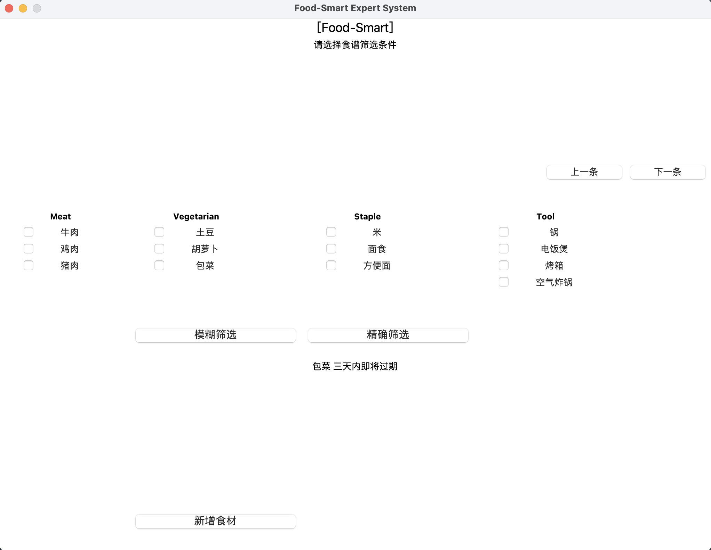
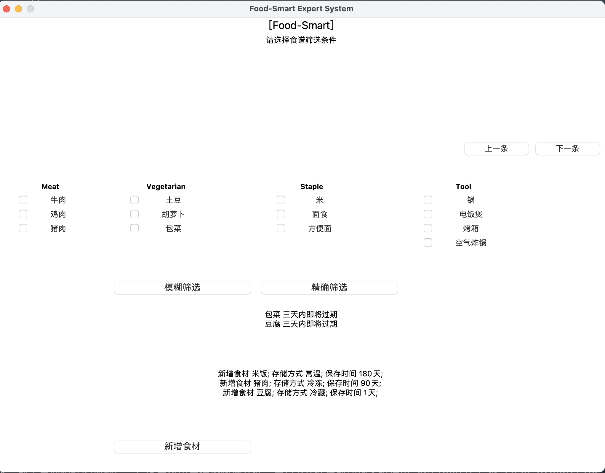
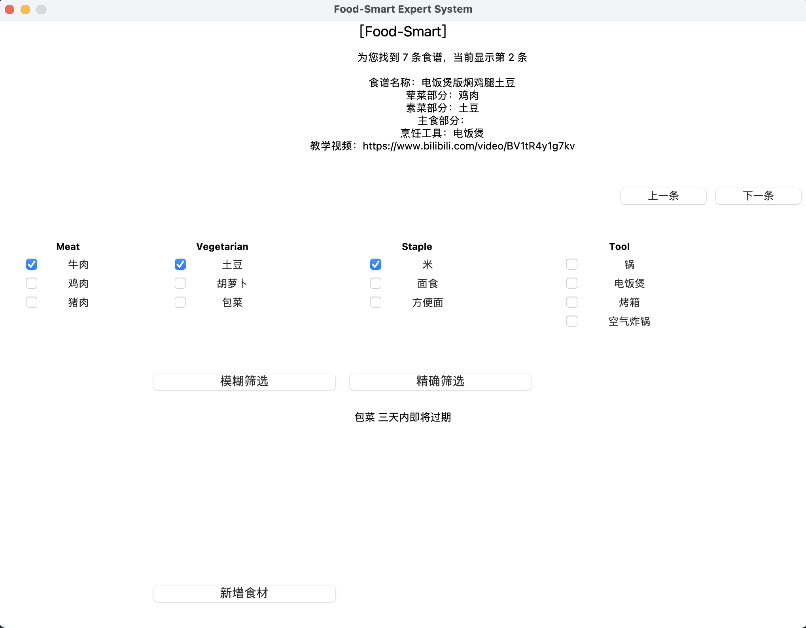
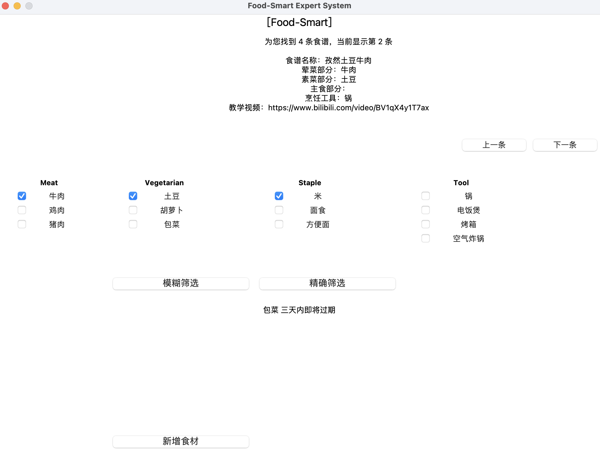

# 基于框架的家庭食材管理+食谱推荐专家系统

杨馥冰 19307130304

## 内容摘要 Abstract

自2020年新冠疫情爆发以来，我国许多城市都经历了或长或短的封闭管理。其中2022年3-5月的上海聚集性疫情，更是让全市人民居家封闭两月有余，日常生活发生了巨大的变化，直到今天都未完全回归正常。许多市民在封城前一天涌入超市大肆购物备齐食材塞满冰箱，却因没有对食材进行合理的管理，以至出现绿叶菜快速腐烂，不得不丢弃，米面调味品快速消耗，甚至缺少做菜用的生抽酱油，团购买了一份蔬菜套餐，却完全不知道如何去烹饪，以至于要花费大量食材和时间去尝试，等等乱象。这些都是封闭期间在校外居住的学生亲身经历的事情，严重影响了正常生活学习的效率。

本文设计了一个以框架为主体，以方法和守护程序为设计思路的专家系统，通过图像识别自动得出食材的种类，根据用户偏好筛选出合适的食谱，并在食材过期前提醒用户及时处理，从而帮助用户合理的使用食材，大幅降低封闭期间的额外时间成本。项目实现语言为Python。专家系统的设计参考了《人工智能 - 智能系统指南》(原书第3版)。

关键词：框架 方法 守护程序

项目GitHub地址：https://github.com/yang-fubing/Food-Smart-Expert-System

项目文件组织

csv/            存储食材信息库，菜谱信息库，当前存储的食材信息
ActionData.py   负责信息显示的 ActionData 类实现
expert.py       专家系统主入口
Dishes.py       菜谱类 Dishes 实现
Ingredient.py   食材类 Ingredient 实现
Init.py         初始化类 Init 实现
new_ingredient/ 存储新获得的食材图片
Store.py        当前存储的食材类 Store 信息


## 一、指定问题、系统范围定义

### 问题指定

Food Smart 专家系统旨在解决玩家面对大量食材时的选择困难问题，包括对食材的识别，管理，烹饪。为了能够帮玩家做出全面周到的选择，Food Smart 专家系统使用框架存储了大量的食材信息，通过这些信息，在用户存放新食材时可以提供帮助。每条记录包括：

Ingredients: 食材名称
Storage: 存储方式
Best-Before: 保存时间/天
Remark: 备注信息

除了食材存储在信息库中的通用信息外，每个存储的具体食材需要单独保存其生产日期 Production Date，从而可以判断其是否过期。每条记录包括：

Ingredients: 食材名称
ProductionDate: 生产日期

除此之外，也对网络上大量食谱进行解析，将其分解为荤菜、素菜、主食、烹饪用具四个部分。为了简化问题，我们不考虑一些复杂的需要多种荤菜素菜主食的食谱，默认每个食谱中仅包含最多一个荤菜，最多一个素菜，最多一种主食。每条记录包括以下内容：

Dishes: 食谱名称
Meat: 荤菜
Vegetarian: 素菜
Staple: 主食
Tool: 烹饪用具
Tutorial: 烹饪教程

在这里给出部分数据记录：

| Dishes | Meat | Vegetarian | Staple | Tool | Tutorial |
| --------- | ------------- | --------- | ------------- | --------- | ------------- |
| 土豆烧牛腩  |  牛肉  |  土豆  |  |  锅 | https://www.bilibili.com/video/BV1qs411u7gj | 
| 电饭煲版焖鸡腿土豆 | 鸡肉 | 土豆 |  | 电饭煲 | https://www.bilibili.com/video/BV1tR4y1g7kv | 
| 电饭煲版蜜汁鸡翅 | 鸡肉 | | |  电饭煲 | https://www.bilibili.com/video/BV1dj411f7sR | 
| 烤箱版爆浆鸡腿 | 鸡肉  |  |  | 烤箱 | https://www.bilibili.com/video/BV1ju411X7mx | 
| 电饭煲版香卤牛肉 | 牛肉 |  | 米 | 电饭煲 | https://www.bilibili.com/video/BV1dR4y1F7H2 |

在项目中，内容被以外部文件的形式选择加载，并初始化为一个个具体实例，因此只要维持对数据的爬取和更新，就能够访问、修改、删除系统中的数据并执行一些其他动作。

### 定义系统范围

Food Smart 专家系统分为两个模块，食材管理模块和食谱推荐模块。

食材管理模块通过摄像头或图像作为输入，用户二选其一设定输入后，专家系统可以通过多种机器学习方法识别食材，从食材信息库中为用户提供相关的信息，并将食材存入数据库。

其运作流程为：
1. 通过摄像头或照片获取食材图像数据
2. 通过多种图像分类系统，分类得到食材类别
3. 处理这一组基本事实，从专家系统的食材库信息库中找到对应信息
4. 将食材信息存储到食材数据库中
5. 在用户界面中显示当前食材信息

食材管理模块还可以当数据库中某些食材接近保质期时在主界面进行提示，其运作流程如下：

1. 每次打开系统或数据库发生更改后，启动流程
2. 从当前存储的食材数据库中查询每个食材距离过期的时间，
3. 将即将过期的食材显示到主界面上

食谱推荐模块为用户提供了以下查询条件：荤菜、素菜、主食、烹饪用具，并可以设定为精确匹配或模糊匹配。在用户对这些条件做出限定后，专家系统就能够为用户提供合适的食谱。
其运作流程为：

1. 用户通过各种选项设定食材，并设定食谱的匹配模式，包括模糊匹配和精确匹配。
2. 专家系统通过数据库中设定的食谱规则，找到匹配的食谱
3. 将匹配的食谱列表显示到主界面上

## 二、框架中类的构建和表示

由于专家系统应当支持动态的加载知识库，所以框架的类信息不能硬编码在程序中，而是需要长期存储在外部文件中，并在推理引擎中加载。

为了存储菜谱信息，我们选择使用 csv 对数据进行存储。读取菜谱信息时，python 的 pandas 模块提供了简单上手的 csv 读取支持，并且 python 还拥有着较为易用的GUI设计模块tkinter，所以本次专家系统使用了python进行编写，框架使用了python的类来设计，框架中的槽对应类的成员变量，填槽的过程对应类的成员函数，开发工具使用了编辑器Visual Studio Code。

由于我们需要支持两个不同的模块，因此需要对食材和菜谱分别设计类。此专家系统共有四个类：一个为 Ingredients 类，包含了各种食材的通用特征，一个为 Dishes 类，包含了各种菜谱的通用特征，一个为 Store 类，包含用户现在储备的食材信息，以及一个 Action 类，用于执行加载、显示、切换、查询的工作，具体设计以及代码实现如下：

### Ingredients 类

| 成员类型 | 成员名称        |
| ------- | ------------- |
| [Str]   | Ingredients   |
| [Str]   | Storage       |
| [N]     | Best-Before   |
| [Str]   | Remark        |

```

class Ingredient:
    def __init__(self, Ingredient, Storage, BestBefore, Remark):
        self.Ingredient = Ingredient
        self.Storage = Storage
        self.BestBefore = BestBefore
        self.Remark = Remark

```

### Dishes 类

| 成员类型   | 成员名称        |
| --------- | ------------- |
| [Str]     | Dishes        |
| [Str]     | Meat          |
| [Str]     | Vegetarian    |
| [Str]     | Staple        |
| [Str]     | Tool          |
| [Str]     | Tutorial      |

```

class Dishes:
    def __init__(self, Dishes, Meat, Vegetarian, Staple, Tool, Tutorial):
        self.Dishes = Dishes
        self.Meat = Meat
        self.Vegetarian = Vegetarian
        self.Staple = Staple
        self.Tool = Tool
        self.Tutorial = Tutorial

```

### Store 类

| 成员类型   | 成员名称        |
| --------- | ------------- |
| [Str]     | Dishes        |
| [Str]     | ProductionDate|

```

class Store:
    def __init__(self, Ingredient, ProductionDate):
        self.Ingredient = Ingredient
        self.ProductionDate = ProductionDate


```

### Action 类

| 成员类型   | 成员名称        |
| --------- | ------------- |
| [S]      | Change Display |

```

class ActionData:
    properties = []
    selection = 0
    
    def change_display(self):
        properties = self.properties
        selection = self.selection
        _ = properties[selection]
        display_message = f"""
                            为您找到 {len(properties)} 条食谱，当前显示第 {selection+1} 条

                            食谱名称：{_.Dishes}
                            荤菜部分：{_.Meat       if not pd.isna(_.Meat)       else ""}
                            素菜部分：{_.Vegetarian if not pd.isna(_.Vegetarian) else ""}
                            主食部分：{_.Staple     if not pd.isna(_.Staple)     else ""}
                            烹饪工具：{_.Tool       if not pd.isna(_.Tool)       else ""}
                            教学视频：{_.Tutorial   if not pd.isna(_.Tutorial)   else ""}
                            """
        return display_message

    def goto_next_property(self):
        # WHEN CHANGED
        if self.selection < len(self.properties)-1:
            self.selection += 1
        return self.change_display()

    def goto_prev_property(self):
        if self.selection > 0:
            self.selection -= 1
        return self.change_display()

```

## 三、专家系统食材识别模块

在 GPU 环境下，我们可以选择 clip 模型进行零样本的食材识别，通过计算食材图像和食材文本名的相似度，可以很容易的对食材进行分类，或者也可以使用其他在食材数据集上进行过微调的分类模型。
图片需要经过简单的预处理，转换成 torch.Tensor 类型。通常而言，为了模型稳定，输入的图像大小应当固定。因此也需要将输入图像转换成固定大小。具体而言，分为以下四个步骤：

lambda im: im.convert("RGB")  # PIL 图像转换成 RGB 类型
T.Resize((224, 224))          # 将图像大小放缩至 224
T.ToTensor()                  # 将图像转换成 torch.Tensor
T.Normalize(mean=[0.485, 0.456, 0.406], std=[0.229, 0.224, 0.225]) # 将图像按预训练模型参数放缩

在 CPU 环境下，我们也可以通过其他图像识别方法，如轮廓识别，SIFT算子，等等，训练分类模型获取食材的视觉信息并进行分类。由于 GPU 环境缺少可视化能力，我们对该识别模块进行 mock，以便于进行可视化作业。

## 四、专家系统规则定义

### 食材管理模块

为了使用专家系统实现即将过期食材提醒功能，我们构建了一条简单的规则用来判断食材是否即将过期（三天内将会过期），即：

Produce-Date + (Best-Before - 3) <= current_date

通过更新食材信息库中的 Best-Before 条目，可以达成更新食材过期规则的目的。

### 食谱推荐模块

此外，为了使用专家系统实现食谱匹配功能，我们构建了两种不同的规则用于判断食谱是否符合用户要求，分别为模糊匹配和精确匹配。

模糊匹配，对应着用户希望找到与某一些食材相关的菜谱。在实际场景中，这对应着用户在购买食材前寻找的过程。比如，用户想尝试鸡肉或牛肉相关的料理，那么就应当在查询 req 中设定 Meat = [鸡肉，牛肉]，设定查询模式为模糊匹配，模型应当返回包含鸡肉或牛肉的料理，如土豆牛腩，那么用户就可以尝试购买土豆和牛肉，作为之后料理的食材。

(dishes.Meat in req.Meat) or (dishes.Vegetarian in req.Vegetarian) or (dishes.Staple in req.Staple) or (dishes.Tool in req.Tool)

精确匹配，对应着用户希望找到仅使用查询中食材的菜谱。在实际场景中，这对应着用户做饭前查询食谱的过程。比如，用户现在手上有鸡蛋，鸡肉，和面粉，希望查询能用这些做出什么菜肴。那么就应设定查询 req 的 Meat = [鸡肉，鸡蛋]，Staple = [面粉]，设定查询模式为精确匹配，模型应当返回仅使用鸡肉、鸡蛋、面粉的料理，如炸鸡米花，鸡蛋饼，用户就可以选择感兴趣的料理进行烹饪。

(dishes.Meat in req.Meat) and (dishes.Vegetarian in req.Vegetarian) and (dishes.Staple in req.Staple) and (dishes.Tool in req.Tool)

通过以上规则，我们可以满足用户在不同状况下的查询需求。此外，通过编辑现有的食谱库文件，也可以很容易的添加删除各种候选菜肴。

## 五、实例初始化

在确定了 Ingredients 类框架，Dishes 类框架和 Action 类框架之后，就可以通过信息库数据在启动专家系统时进行对象实例化。
在实例化完成后，专家系统将根据数据中的“素菜、荤菜、主食、烹饪工具” 更新交互界面中的下拉菜单，这样即使数据出现改动系统仍然有较好的鲁棒性。
专家系统通过读取 csv 文件夹下的 dishes.csv，ingredients.csv，store.csv 文件得到食谱、食材、当前储备食材的信息，并使用 Init.py 中的代码来创建新实例：

```

df = pd.read_csv('csv/dishes.csv', encoding='GB18030')
print(df.loc[0])

# 满足用户搜索条件的游戏
comp_k = ['Meat', 'Vegetarian', 'Staple', 'Tool']

component = {k: [] for k in comp_k}
componentVar = {k: [] for k in comp_k}

Dishes_list = []
for idx, _ in df.iterrows():
    for k in comp_k:
        if not pd.isna(_[k]) and _[k] not in component[k]:
            print(_[k])
            component[k].append(_[k])
    Dishes_list.append(Dishes(**_.to_dict()))


df = pd.read_csv('csv/ingredients.csv', encoding='GB18030')
print(df.loc[0])

Ingredient_list = []
for idx, _ in df.iterrows():
    Ingredient_list.append(Ingredient(**_.to_dict()))


df = pd.read_csv('csv/store.csv', encoding='GB18030')
print(df.loc[0])

Store_list = []
for idx, _ in df.iterrows():
    year, month, date = _['ProductionDate'].split('/')
    dtime = datetime(int(year), int(month), int(date))
    timestamp = dtime.timestamp()
    Store_list.append(
        Store(
            Ingredient = _['Ingredient'],
            ProductionDate = int(timestamp)
        )
    )

```

## 六、设计显示

专家系统通过在命令行输入 python expert.py 后启动并自动加载数据，根据数据更新主界面上的可选项。其显示界面设计如下：



界面下半部分为食材管理模块，这个界面可以通过文字的方式，显示即将过期的食材。
如，读取存储的数据后，专家系统发现保存的包菜距离过期只剩下不到三天时间，就输出提示“包菜 三天内即将过期”。

除此之外，该模块也使得用户可以加入新的食材，并显示新加入食材的相关信息。如，点击“新增食材”按钮，模型将会读取 new_ingredient 目录下的图片，并通过食材识别模块，识别出存在“猪肉”，“米饭”，“豆腐”三种食材，将其加入用户存储的食材中。其中，豆腐由于保质期较短，会立即提示即将过期。结果如下图所示：



界面上半部分为食谱推荐模块，这个界面允许用户选择食谱的组成部分，并逐个的进行展示。如，指定牛肉，土豆，米饭作为食材后，选择“模糊筛选”选项，系统找到了7条相关的食谱。其中，由于是模糊筛选，因此也包含了鸡腿土豆这种，包含未指定食材的菜谱。



而选择“精确筛选”选项后，系统找到了4条相关的食谱，这些食谱仅使用了用户指定的食材。



通过这些功能的组合，专家系统可以达到帮助用户管理食材，推荐食谱的目的。

## 七、定义守护程序

在本次实现的基于框架的系统中，定义了以下 WHEN CHANGE 方法和守护程序：

当用户点击“上一条”或“下一条”后，系统调用 switch_property() WHEN CHANGE 方法更新展示的食谱信息。

```

# WHEN CHANGED方法
def switch_property(direction):
    if direction == 'prev':
        message = action_data.goto_prev_property()
    else:
        message = action_data.goto_next_property()
    result_message['text'] = message

```

当用户点击“新增食材”后，系统发现食材数据发生更新，调用 find_out_date() WHEN CHANGE 方法更新过期食材信息。

```

# WHEN CHANGE方法
def find_out_date():
    warning_text = ""
    for _store in Store_list:
        for _ingredient in Ingredient_list:
            if _store.Ingredient == _ingredient.Ingredient:
                if _store.ProductionDate + (_ingredient.BestBefore - 3) * 24 * 60 * 60 <= today:
                    warning_text = warning_text + f"{_store.Ingredient} 三天内即将过期\n"

    warning_message['text'] = warning_text

```

当出现查询显示界面时，用户通过选择设定一系列条件来找到对应的食谱。由于用户与组件的交互顺序往往是随机的不可预测的，所以不能够将守护程序和页面选项组件链接起来，而是当用户完成了所有条件设置且与“筛选”按钮交互时，才激活守护程序，在所有食谱中选取符合用户要求的实例。代码实现如下:

```

# 守护程序
def filter(mode):
    # 从各个组件中得到界面中用户选择的查询条件 
    req = {}
    for k in comp_k:
        req[k] = []
        for _component, _var in zip(component[k], componentVar[k]):
            if _var.get():
                req[k].append(_component)

    action_data.properties = []
    for _dishes in Dishes_list:
        if mode == "fuzzy":
            if (_dishes.Meat in req['Meat']) or \
               (_dishes.Vegetarian in req['Vegetarian']) or \
               (_dishes.Staple in req['Staple']) or \
               (_dishes.Tool in req['Tool']):
                action_data.properties.append(_dishes)
        elif mode == "exact":
            if req['Tool'] == []:
                req['Tool'] = component['Tool']
            if (pd.isna(_dishes.Meat)       or _dishes.Meat in req['Meat']) and \
               (pd.isna(_dishes.Vegetarian) or _dishes.Vegetarian in req['Vegetarian']) and \
               (pd.isna(_dishes.Staple)     or _dishes.Staple in req['Staple']) and \
               (pd.isna(_dishes.Tool)       or _dishes.Tool in req['Tool']):
                action_data.properties.append(_dishes)

    # 终端符合用户要求的选取结果
    print('【RESULT】', len(action_data.properties))
    # 在窗口中显示符合用户要求的首条记录
    # 检测结果条数是否 > 0
    if len(action_data.properties):
        action_data.selection = 0
        result_message['text'] = action_data.change_display()
    else:
        result_message['text'] = '数据库中没有符合要求的食谱'

def fuzzy_filter():
    return filter(mode = 'fuzzy')

def exact_filter():
    return filter(mode = 'exact')

```

## 七、总结

本次专家系统的设计，模拟了一名人类专家管理食材和推荐食谱时的思维方式，用具体的食谱数据和食材数据建立了知识库，用框架进行知识的结构化表达，用可交互的UI让玩家能够向专家提供清晰的需求，除此之外还能及时地进行知识的修改以及更新。

而这个专家系统也存在着不足：由于网络数据较杂，数据来源通常只能依靠人工输入，因此存在记录属性缺少的现象，专家无法进行完善的判断；其次，目前的专家系统只包含了简单的菜谱，即只有荤菜素菜主食各自最多只有一项，无法匹配一些复杂的食谱；最后，目前的专家系统不能根据用户偏好进行更好的推荐，而是仅仅做了筛选，这部分需要更复杂的推荐算法。

综上，此专家系统有着一定的优势，同时也有着明显的不足。希望通过日后的学习，我能够更多地积累人工智能领域的知识和实践经验，让设计的应用能够更好地贴近用户需要，满足用户要求。
